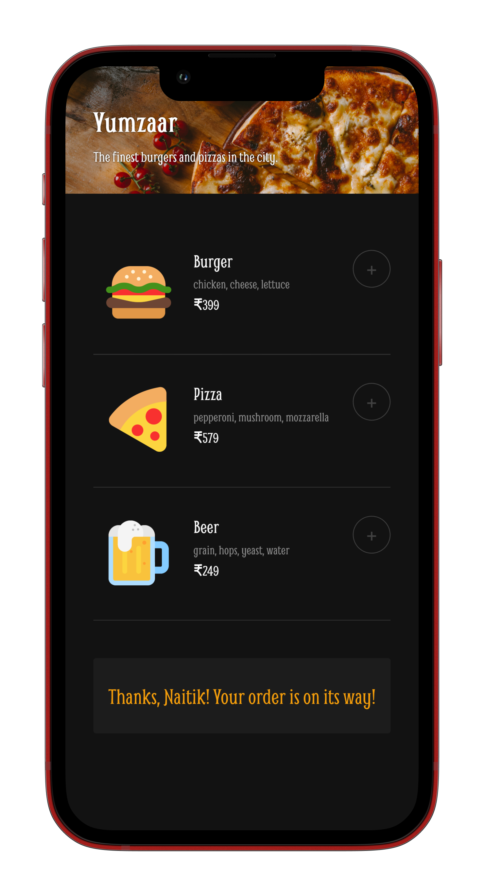

#  Yumzaar

Yumzaar is a basic food ordering web app. The users can add items from the menu to their cart and place an order. A payment modal pops up, after which the order is confirmed.

### Screenshot

### Link

- Live Site URL: [Netlify](https://yumzaar.netlify.app)

### Built with

- HTML
- CSS
- JavaScript